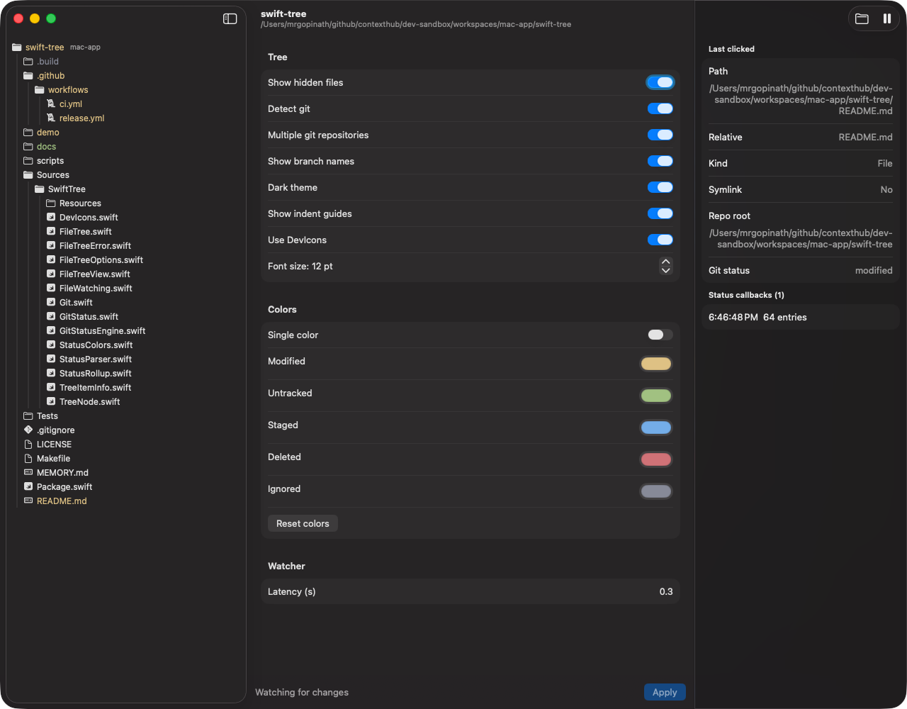
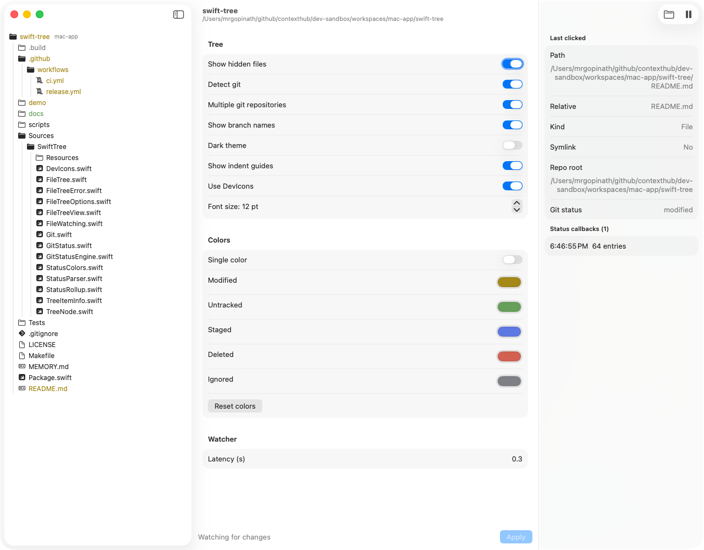

# swift-tree

[](https://github.com/contexthub-dev/swift-tree/releases/latest)

A SwiftUI file tree for macOS apps, like the project navigator in an IDE. It
colors every file and folder by its git status and keeps up with changes on
disk and in git. Nested repositories are supported.

- macOS 14+, SwiftUI (AppKit hosts embed it with `NSHostingView`)
- No dependencies outside Apple frameworks
- Uses the `git` CLI (2.30+) found on `PATH`
- Apache 2.0

| Dark (default) | Light |
|----------------|-------|
|  |  |

The [demo app](#demo) opened on this repo: the tree on the left (devicon file
icons, indent guides, git status colors, the branch label on the repo root),
the demo's settings in the middle, and the last-clicked item and status
callbacks on the right.

## Install

```swift
.package(url: "https://github.com/contexthub-dev/swift-tree.git", from: "0.2.0")
```

and add `"SwiftTree"` to your target's dependencies.

## Embed

```swift
import SwiftTree
import SwiftUI

struct Sidebar: View {
  @State private var tree = FileTree(
    root: URL(fileURLWithPath: "/path/to/project"),
    onError: { error in print("swift-tree:", error) }
  )

  var body: some View {
    FileTreeView(tree: tree) { item in
      // Left click: files select, folders also toggle open.
      if !item.isDirectory { open(item.url) }
    } rightClickMenu: { item in
      Button("Reveal in Finder") {
        NSWorkspace.shared.activateFileViewerSelecting([item.url])
      }
      Button("Copy Relative Path") {
        NSPasteboard.general.clearContents()
        NSPasteboard.general.setString(item.relativePath, forType: .string)
      }
    }
  }

  func open(_ url: URL) { /* … */ }
}
```

Each click handler gets a `TreeItemInfo`: absolute `url`, `relativePath` from the
tree root, `isDirectory`, `repoRoot`, and `gitStatus`.

## Options

Everything configurable, in one place. `FileTreeOptions` is fixed when the
`FileTree` is created; to change one, create a new tree.

```swift
var options = FileTreeOptions()
options.detectGit = true                        // false: no colors, no git calls
options.canHaveMultipleGitRepositories = true   // false: ignore nested repos
options.showHiddenFiles = true                  // toggle later via tree.showHiddenFiles
options.showBranchNames = false                 // label repo-root folders with their branch
options.theme = .dark                           // .light or .dark, regardless of system appearance
options.showIndentGuides = true                 // vertical lines beside open folders' contents
options.fontSize = 12                           // 8-32; row height and indent scale with it
options.colors.modified = .orange               // override any status color
options.colors = StatusColors(all: .orange)     // one color for every change; ignored stays gray
options.useDevIcons = true                      // devicon file-type glyphs; false: generic doc icon

let tree = FileTree(root: root, options: options)
```

### `FileTreeOptions`

| Option | Default | Effect |
|--------|---------|--------|
| `detectGit` | `true` | `false`: no status colors, no branch labels, and no git command ever runs. |
| `canHaveMultipleGitRepositories` | `true` | `false`: nested repos are ignored; everything resolves against the repo containing the root. |
| `showHiddenFiles` | `true` | Initial value of `tree.showHiddenFiles` (dot-named entries; `.DS_Store` is never shown). |
| `showBranchNames` | `false` | Label each repo-root folder with its branch, or the short SHA when HEAD is detached. |
| `theme` | `.dark` | `.light` or `.dark` for the tree only, independent of the system and the host window. |
| `showIndentGuides` | `true` | A vertical line beside the contents of each open folder. |
| `fontSize` | `12` | Point size of row names; icons, branch labels, row height and indent scale with it. Clamped to 8-32. |
| `colors` | `StatusColors.zed` | Text color per git status (see below). |
| `useDevIcons` | `true` | devicon glyphs on file rows. Unmapped files, folders and symlinks keep their SF Symbol. |

### `StatusColors`

| Form | Effect |
|------|--------|
| `StatusColors.zed` | Zed's One Dark / One Light colors: `modified`, `untracked`, `staged`, `deleted`, `ignored`. |
| `StatusColors(modified:untracked:staged:deleted:ignored:)` | Every status set explicitly. |
| `StatusColors(all: color)` | One color for modified, untracked, staged and deleted; `ignored` keeps Zed's gray. |
| `options.colors.staged = .blue` | Any single status can be changed afterwards. |

Unmodified rows always use the normal text color.

### `FileTree` init

```swift
FileTree(root: URL,
         options: FileTreeOptions = .init(),
         watcher: (any FileWatching)? = nil,          // nil: the tree creates its own FSEventsWatcher
         onError: @MainActor (FileTreeError) -> Void = { _ in })
```

`onError` receives:

| Error | When |
|-------|------|
| `.gitUnavailable` | No usable `git` on `PATH`. Once; the tree shows no colors. |
| `.gitFailed(repo:message:)` | One repo's git command failed. Once until it recovers; other repos are unaffected. |
| `.devIconsUnavailable` | `useDevIcons` is on but the font isn't bundled (see [Developing and releasing](#developing-and-releasing)). Once; file rows show `doc`. |

### Changeable at runtime

| On `FileTree` | Effect |
|---------------|--------|
| `showHiddenFiles` | Show or hide dot-named entries. Open folders stay open. |
| `setExpanded(url, Bool)` | Open or close a folder. The root starts open. |
| `pause()` / `await resume()` | Stop and restart following file changes (see [Watching](#watching)). |

### `FSEventsWatcher`

| Parameter | Default | Effect |
|-----------|---------|--------|
| `latency` | `0.3` s | How long FSEvents batches changes before one refresh. |

### `FileTreeView`

| Parameter | Default | Effect |
|-----------|---------|--------|
| `tree` | required | The `FileTree` to draw. |
| `onLeftClick` | no-op | Called with the row's `TreeItemInfo` after it's selected (folders also toggle). |
| `rightClickMenu` | none | A `@ViewBuilder` returning the context menu for the row's `TreeItemInfo`. Empty: no menu. |

`.git` is never shown. Symlinks are listed but not followed.

## Watching

By default the tree creates its own FSEvents watcher. To share one across your
app, pass anything conforming to `FileWatching` (e.g. one `FSEventsWatcher`):

```swift
let watcher = FSEventsWatcher()
let tree = FileTree(root: root, watcher: watcher)

tree.pause()        // stop following file changes; git status still updates
await tree.resume() // re-read the tree, keep open folders open, watch again
```

## Status API

Use git status without the view:

```swift
let sub = try tree.register(path: root.appending(path: "Sources")) { changes in
  // First call: every file and folder under the path. Then: only what changed.
}
tree.unregister(sub)

let all = try await tree.snapshot(of: root)  // [URL: GitStatus], incl. deleted files
```

Paths outside the root throw `FileTreeError.pathOutsideRoot`. With
`detectGit = false`, `snapshot` throws `.gitDetectionDisabled`, and `register`
succeeds but never calls back.

## Demo

`demo/` is a small app for trying every option by hand (the screenshots above).
Pick a folder, change settings, and click **Apply** to rebuild the tree with them.

| Where | What you can do |
|-------|-----------------|
| Settings → Tree | Show hidden files, Detect git, Multiple git repositories, Show branch names, Dark theme, Show indent guides, Use DevIcons, Font size (8-32 pt) |
| Settings → Colors | Single color for every change, or a color per status (modified, untracked, staged, deleted, ignored); Reset colors |
| Settings → Watcher | FSEvents latency (0.05-5 s) |
| Toolbar | Choose Folder…, Pause / Resume watching |
| Tree | Left click selects (folders toggle); right click shows Reveal in Finder and Copy Relative Path |
| Inspector | The last-clicked item's `TreeItemInfo`, and every status callback as it arrives |
| Footer | Watching state, or the last `FileTreeError` |

```sh
make demo                   # choose a folder in the app
make demo ROOT=~/code/my-repo
```

## Developing and releasing

File-type icons come from [devicon](https://github.com/devicons/devicon) (MIT).
Its font isn't committed to `main`. Fetch the latest release before building:

```sh
make fonts    # downloads into Sources/SwiftTree/Resources/DevIcons (gitignored)
make test
```

Without it everything still builds, but file rows show the generic `doc` icon
and `FileTree` reports `.devIconsUnavailable` once. CI runs `make fonts` first.

Releases come only from the **Release** workflow (Actions → Release → Run
workflow, enter `X.Y.Z`). It fetches the latest devicon, runs the tests, commits
the font on a release-only commit on top of `main`, and pushes just the tag.
So each tag carries its font, and `main` never does. Don't push tags by hand:
the tag would have no font.
